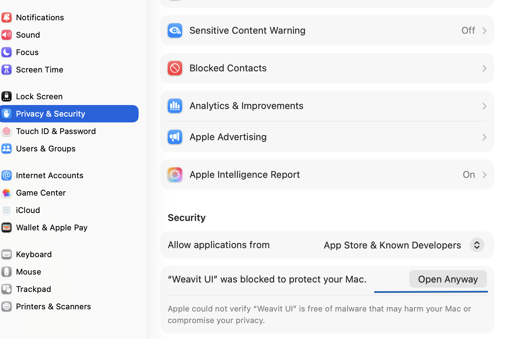

# Weavit UI — a Weaviate GUI for macOS, Windows & Linux

**Weavit UI is a free, open-source Weaviate GUI: a cross-platform desktop client for the
[Weaviate](https://weaviate.io) vector database.** Browse collections, view/edit/delete/insert
objects, inspect named vectors, and run vector, keyword (BM25), and hybrid searches — then
manage the instance itself: tenants, backups, aliases, users and roles, and replication —
against **any** Weaviate instance (local, self-hosted, or Weaviate Cloud).

🌐 **[weavit-ui website →](https://xenoraai.github.io/weavit-ui/)**

[](https://github.com/XenoraAI/weavit-ui/releases/latest)
[](https://github.com/XenoraAI/weavit-ui/releases)
[](https://github.com/XenoraAI/weavit-ui/actions/workflows/ci.yml)
[](./LICENSE)

> ⚠️ **Community project — not affiliated with or endorsed by Weaviate B.V.**
> “Weaviate” is a trademark of its respective owner. Weavit UI is an independent, open-source tool.

---

## Screenshots


---

## Download

### ⬇️ [Download the latest release](https://github.com/XenoraAI/weavit-ui/releases/latest)

Pick the installer for your platform from the release assets:

| Platform | Installer |
| --- | --- |
| **macOS** — Apple Silicon (M1/M2/M3…) | the `-arm64.dmg` file |
| **macOS** — Intel | the `-x64.dmg` file |
| **Windows** | the `-setup.exe` file (NSIS installer) |
| **Linux** | the `.AppImage` (portable) or `.deb` (Debian/Ubuntu) file |

These are **unsigned community builds** — notarizing an app requires a paid Apple Developer
account, and this is a free open-source project. Your OS will flag them on first launch.

### 🍎 First launch on macOS

macOS blocks the app the first time you open it. This is expected, and **you only do this once**:

1. Open **Weavit UI** from Applications. macOS blocks it — click **Done**.
2. Go to **System Settings → Privacy & Security**.
3. Scroll down to the **Security** section. You'll see *"Weavit UI" was blocked to protect your Mac.*
4. Click **Open Anyway**.
5. Enter your Mac login password (or Touch ID) to confirm.



Weavit UI opens, and every launch after this one is normal — you won't be asked again.

<details>
<summary><b>Instead getting "Weavit UI is damaged and can't be opened"?</b></summary>

That's a different problem, and it only affects the **Apple Silicon build of v1.0.0**, which
shipped without a valid code signature. macOS refuses to launch it outright — there's no
**Open Anyway** button to click.

**[Download v1.0.1 or later](https://github.com/XenoraAI/weavit-ui/releases/latest)**, which
fixes it. Or repair the copy you already have:

```bash
codesign --force --deep --sign - "/Applications/Weavit UI.app"
xattr -dr com.apple.quarantine "/Applications/Weavit UI.app"
```
</details>

### 🪟 Windows · 🐧 Linux

On Windows, SmartScreen flags the installer — click **More info → Run anyway**. On Linux there's
no prompt; mark the AppImage executable with `chmod +x` before running it.

---

## Features

- **Connections** — local, Weaviate Cloud, or fully custom (separate HTTP + gRPC host/port).
  Anonymous, API-key, or OIDC auth (password, client credentials, bearer token), with
  per-request timeouts and an optional gRPC proxy. Credentials are encrypted at rest with
  your OS keychain (Electron `safeStorage`). Extra headers for third-party vectorizer keys.
- **Schema & collections** — sidebar tree, per-collection config (properties, vectorizer,
  vector index, multi-tenancy). Create, edit and delete collections: change settings, add
  properties, and drop a collection behind a typed confirmation. Import/export a schema
  to move a definition between instances.
- **Data** — paginated object browser with click-to-sort columns, structured + raw-JSON
  views, named vectors, tenant selector, insert / edit (merge or replace) / delete. Bulk
  import from JSON, NDJSON or CSV, and export results or a whole collection.
- **Search & RAG** — `nearText`, `nearVector`, `nearObject`, `nearImage`, `nearMedia`, BM25
  and hybrid, with a visual filter builder, target-vector selection, property projection,
  autocut, group-by, reranking and consistency levels. Generative search (single-prompt and
  grouped-task) runs in its own tab, and every query is kept in a re-runnable history.
- **Multi-tenancy** — per-collection tenant list; create, delete, and move tenants between
  active, inactive and offloaded.
- **Backup & restore** — create, watch, cancel and restore backups on any configured
  backend, with per-collection include/exclude.
- **Aliases** — list, create, repoint and delete collection aliases.
- **Access control (RBAC)** — roles with a permission editor covering every resource kind,
  database users (create, rotate keys, activate/deactivate), role grants, and OIDC group
  assignments. Connections whose key is read-only say so in the status bar.
- **Cluster** — per-node and per-shard detail, sharding state, and replica movement with a
  live replication queue.
- **Admin** — cluster meta & modules, node status, tokenizer preview, and raw GraphQL /
  REST consoles.

## Architecture

Weavit UI is an **Electron** app. The **main process (Node.js)** runs the official
[`weaviate-client`](https://www.npmjs.com/package/weaviate-client) v3 (which needs gRPC and is
Node-only) and exposes a small typed IPC surface. The **React + TypeScript renderer** talks only
to that surface via a `contextBridge` preload — it never reaches Weaviate directly.

```
React renderer  ──window.api──►  preload (contextBridge)  ──IPC──►  main (Node + weaviate-client)  ──►  Weaviate
```

Security: `contextIsolation` on, `nodeIntegration` off, `sandbox` on, production CSP, and
IPC-only data access.

## Getting started

```bash
# 1. Install deps (pnpm recommended; npm works too)
pnpm install

# 2. (optional) start a throwaway local Weaviate to point at
#    HTTP :8080, gRPC :50051, anonymous access, no vectorizer module
docker run -d --name weaviate -p 8080:8080 -p 50051:50051 \
  -e AUTHENTICATION_ANONYMOUS_ACCESS_ENABLED=true \
  -e DEFAULT_VECTORIZER_MODULE=none \
  cr.weaviate.io/semitechnologies/weaviate:1.28.2

# 3. Run in dev
pnpm dev
```

In the app: **New connection → Local** (host `localhost`, HTTP `8080`, gRPC `50051`, auth None) →
select it in the sidebar to connect.

## Build & package

```bash
pnpm build          # typecheck + bundle main/preload/renderer
pnpm dist:mac       # or dist:win / dist:linux — produces installers in release/
```

Targets: macOS Intel + Apple Silicon (dmg/zip), Windows (nsis), Linux (AppImage/deb) via
`electron-builder`. Official installers are built and published automatically from a `vX.Y.Z` tag —
see [RELEASING.md](./RELEASING.md).

## Project layout

```
src/main/       Electron main: weaviate client wrapper, IPC handlers, encrypted secrets
src/preload/    contextBridge — the only bridge to the renderer
src/renderer/   React UI (features: connections, schema, data, query, generate, stats,
                tenants, alias, backup, rbac, cluster, admin)
src/shared/     IPC contract types + channel names (shared by main & renderer)
```

## Contributing

Contributions are welcome! See [CONTRIBUTING.md](./CONTRIBUTING.md) to get set up, and please read
our [Code of Conduct](./CODE_OF_CONDUCT.md). Found a security issue? See [SECURITY.md](./SECURITY.md).

- 🐛 [Report a bug](https://github.com/XenoraAI/weavit-ui/issues/new?template=bug_report.yml)
- 💡 [Request a feature](https://github.com/XenoraAI/weavit-ui/issues/new?template=feature_request.yml)
- 📦 Cutting a release? See [RELEASING.md](./RELEASING.md).

## FAQ

**Is there a GUI for Weaviate?**
Yes — this one. Weavit UI is a free, open-source desktop GUI for Weaviate on macOS, Windows, and
Linux. It connects to any instance and gives you a collection browser, an object editor, a vector
inspector, and a search builder in one window.

**How do I browse Weaviate collections?**
Add a connection pointing at your Weaviate host, and every collection in the schema shows up in
the sidebar. Selecting one opens a paginated object browser: read properties, switch to raw JSON,
pick a tenant on multi-tenant collections, and open any object to see its named vectors.

**Does it work with Weaviate Cloud?**
Yes. Local, Weaviate Cloud, and fully custom setups with separate HTTP and gRPC hosts and ports
all work, with API-key or anonymous auth.

**Where are my API keys stored?**
On your machine, encrypted at rest with your OS keychain via Electron `safeStorage`. No account,
no sync, no telemetry.

**Is this an official Weaviate product?**
No — see the disclaimer at the top. Weavit UI is an independent community project built on the
official [`weaviate-client`](https://www.npmjs.com/package/weaviate-client) library.

## License

[Apache-2.0](./LICENSE). Contributions welcome.
